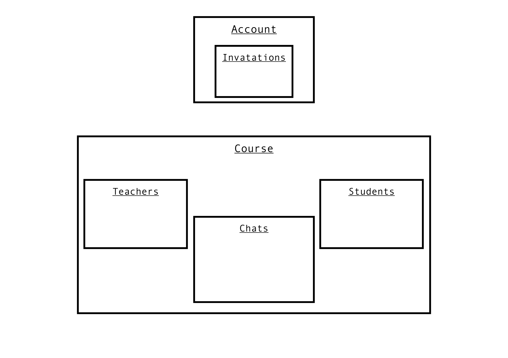

# home-schooling

## Description:

- With this program you can create an account.
- You can create courses and invite other people to the course.
- In a course the course leader can upload folders and files from his computer.
- The students who are in the course can then clone the course onto their computer.
  If you clone the whole course, you get 2 folders. In one of the folders, there are all of the
  files and folders from the teacher. In the other folder the students can put solutions to exercises
  which they had to do. In the app they can then submit the solutions and the teacher can see / correct
  them.
- In every course the students can  talk to the teacher in a chat if they have questions or problems.
  There's also a chat for the whole course

- As the leader of a course, you can also add other teachers (invite them)

- In a course, you can have one of the two roles: Teacher (Admin) and Student

### Things Admins can do:

- invite students

- invite teachers

- change/add/delete folders and files

- see/correct students' solutions

- create new chat (there's automatically a chat for every student)

- talk in every chat

### Things Students can do:

- submit solutions for exercises

- see teacher's correction of solutions

- talk in different chats

## How to use it:

There is a desktop app. In the app you first have to choose a folder on your computer, in which you
clone all of your courses. You can even have subdirectories in that folder, for different areas.

### Example of course folder:

- my-courses

- - hobbies-courses

- - - drumming-course

- - - piano-course

- - sports-courses

- - - football-course

- - - handball-course

- - math-courses

- - science-course

## How we code the backend:

### Classes:

- Account: {
    name: name of account,
    password: passsword of account,
    id: id of account,
    courses: courses of account (with role = teacher/student),
    inbox: new invatations
}

- Course: {
    name,
    id,
    teachers,
    students,
    chats
}

- Invatation: {
    from_user,
    to_user,
    course,
    role
}

- Chat: {
    name,
    id,
    people
}

